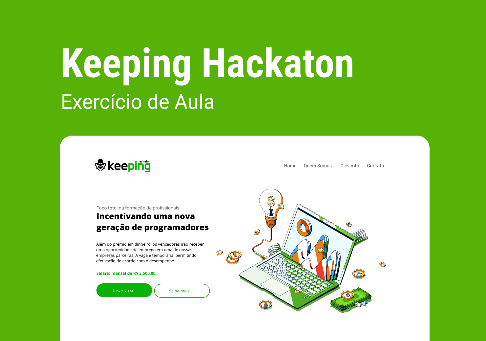

# Keeping Hackaton

## 👨‍💻 Sobre este repositório

Esse repositório contém uma landing page simples feita apenas com HTML e CSS. Esse material é parte do conteúdo utilizado nas aulas de programação do Curso Técnico em Informática do Instituto Loide Martha ( Duque de Caxias - RJ). 

O código dessa aplicação é baseado em um layout, disponível no Figma, que pode ser acessado [aqui](https://www.figma.com/file/H6AIWVlC7j1qaHc9OlUg1l/Loide-Martha---Exerc%C3%ADcio---Keeping-Hackaton?node-id=0%3A1).

